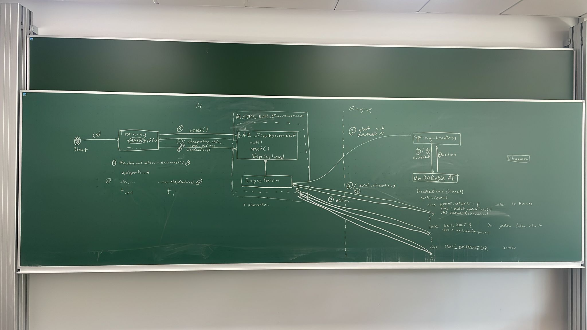

# UnBARableAI: Environment
This repository contains the code for the reinforcement learning environment for Beyond All Reason. 
## Architecture
Below you can see the basic architecture for communication between our environment and BAR.

Generally speaking, we are trying to decouple training on the python side from actually interfacing with the engine. The idea is to implement a custom "dummy" AI inside the engine, which uses [gRPC](https://grpc.io/) to call methods in our python-side environment. Depending on the different types of events, different methods will be called using this method.

### Shared memory
gRPC is meant to only issue function calls without transmitting large binary data, like a unit with all its attributes. Instead, we want to share memory between the engine and the environment, so gRPC only transmits where the actual relevant information resides in that shared memory.

## Dependencies
As mentioned already, this project depends on gRPC and thereby [protobuf](https://protobuf.dev/). To manage the dependencies, package managers are used:

- [Conan (v2)](https://conan.io/) for C++
- [uv](https://docs.astral.sh/uv/) for python